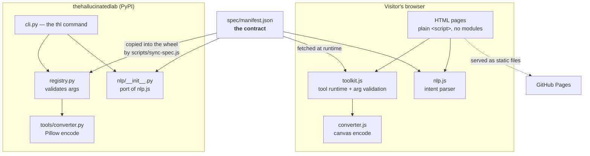

# Architecture

> Standing constraints live in [STANDARDS.md](STANDARDS.md). This file
> explains the decisions those constraints came out of.

The short version: **a static site with no server, and a pip package
that shares one spec file with it.**

Everything below follows from two constraints that were chosen
deliberately and are worth keeping:

1. **The site has no build step.** What is in the repo is what gets
   served. There is no bundler, no transpiler, no framework. You can
   open any `.html` file and read exactly what the browser gets.
2. **Nothing leaves the visitor's machine.** No analytics, no telemetry,
   no third-party origins, no backend we operate. Image conversion runs
   on a canvas in the visitor's own tab.

## The pieces

## Why the spec is a file and not code

`spec/manifest.json` defines every tool, its arguments, their types,
bounds and defaults. Three consumers read it:

- `toolkit.js` fetches it at runtime and validates the form against it
- `nlp.js` and its Python port use it to fill slots from a sentence
- `registry.py` validates the Python API against a copy baked into the
  wheel

The alternative was restating the bounds in each place. That works right
up until quality caps at 100 in the browser and 95 in Python, and the
website documents an argument the package rejects. `scripts/sync-spec.js
--check` fails CI if the wheel's copy has drifted.

**This is the single most important structural decision in the repo.**
If you change one thing, change it in the manifest.

## Why there is no backend

There nearly was. The converter looked like it needed one — upload a
file, convert it, download the result. It does not: `canvas.toBlob`
encodes PNG, JPEG and WebP in every browser that matters, and the file
never leaves the tab.

That removed, in one decision: an upload endpoint, a file size limit, a
virus scan, temporary storage, a cleanup job, rate limiting, and a
privacy policy explaining what we do with people's images. The answer is
that we never receive them.

The Assistant page originally talked to a local Ollama runtime over
`http://localhost:11434`. That was removed in favour of tools that run
in the page, because "install Ollama first" is a worse first experience
than a converter that just works.

## Why plain `<script>` and not modules

Modules would mean either a bundler or `type="module"` on every tag plus
CORS-correct paths. The site is 24 small scripts with no dependency
graph worth managing. Functions defined at the top level of one file are
called from another; `eslint.config.js` declares those so `no-undef`
still catches typos.

The cost is real and worth naming: there is no tree-shaking and no
import graph, so dead code has to be found by reading. The `@pure-start`
/ `@pure-end` sentinels exist so the testable logic can still be loaded
under Node without a module system.

## Security posture

GitHub Pages serves static files and **cannot set response headers**.
Everything expressible in a `<meta>` tag is set on every page — the CSP
and `Referrer-Policy`. Four headers are therefore not in force:
`frame-ancestors`, `X-Frame-Options`, `X-Content-Type-Options`, and
`Permissions-Policy`. `SECURITY.md` lists them rather than letting
anyone assume they are on. Putting a CDN in front would close all four.

The CSP is `script-src 'self'` with no `unsafe-inline`. That is only
worth the bytes because there is no inline script anywhere — which is an
invariant a test enforces, not a convention people remember.

The founder dev-mode switch in `script.js` is **not a security
boundary** and says so in its own comment. The dev markup ships to every
visitor; the gate stops accidental discovery, not a determined reader.

## Where state lives

| State | Lives in | Bounded by |
|---|---|---|
| Community post drafts | `localStorage` | 50 entries, evicted oldest-first |
| Dev/live mode | `localStorage` | single key |
| Founder key | `localStorage` | single key |
| Tool manifest | in-memory promise | one fetch per page load |

There is no server-side state because there is no server. Every page
works with the network off after first load, except the manifest fetch.

## Scaling

The honest answer is that a static site on a CDN does not have a scaling
story worth writing — GitHub Pages will serve this to a million people
without anyone doing anything.

The things that would actually force a change:

- **A tool that cannot run client-side** (video transcode, anything
  needing a model). That means a real backend, and every question the
  converter dodged comes back at once.
- **Accounts.** Certificates are currently a page. Making them
  verifiable per-person needs identity, which needs a server.
- **Community posts becoming real.** They are `localStorage` drafts
  today and are explicitly described as such in the UI. Publishing them
  means moderation, storage, and abuse handling.

Each of those is a "then we are a different kind of project" decision,
not an incremental one. Worth doing deliberately.

## Performance budget

In the README, enforced by `test/site-invariants.test.js` rather than
left as an aspiration. Current homepage: ~96 KB transferred across 8
requests from a single origin.
